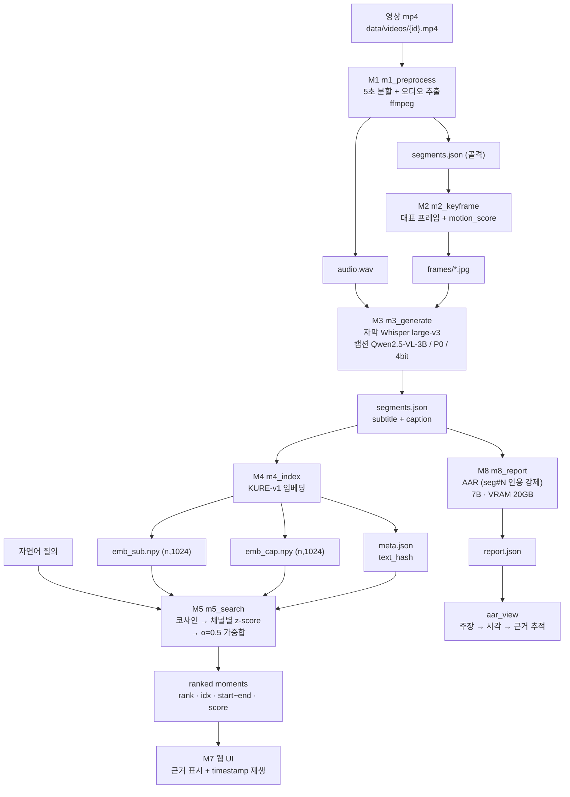

# 시스템 아키텍처 (실제 코드 기준, 2026-08-25)

배포 경로만 그린다. 모델 후보(4B)·P2·P3는 **production path에 없다.**

## 파이프라인



## 단계별 실제 identity

| 단계 | 코드 | 산출 파일 | 확정값 |
|---|---|---|---|
| 분할 | `src/m1_preprocess.py` | `work/{id}/audio.wav` · `segments.json` | `seg_len_sec: 5` |
| 프레임 | `src/m2_keyframe.py` | `work/{id}/frames/` | `frame_sample_fps: 3` · `gaussian_sigma: 1.0` |
| 자막 | `src/m3_generate.py` | `segments.json.subtitle` · `stt_cache.json` | `stt_model: large-v3` · `ko` |
| 캡션 | `src/m3_generate.py` | `segments.json.caption` | `Qwen/Qwen2.5-VL-3B-Instruct` · `vlm_4bit: true` · `max_pixels 602112` · `max_new_tokens 128` · `rep_penalty 1.1` · 프롬프트 P0 |
| 임베딩 | `src/m4_index.py` | `emb_sub.npy` · `emb_cap.npy` · `meta.json` | `nlpai-lab/KURE-v1` · 1024차원 |
| 검색 | `src/m5_search.py` | (메모리) | 코사인 → **z-score** → α 가중합 · `static_threshold: 0` |
| 융합 α | CLI 주입 | — | **0.5** (`results/alpha_search_dev.json`의 `alpha_star`) |
| 경고 | UI 표시 계층 | — | `abstention_tau: 0.55` · `max(sub, cap)` 기준 · **배너만, 랭킹 불변** |
| UI | `src/m7_webui.py` · `src/webui/index.html` | `results/search_log.jsonl` | FastAPI · Range 재생 |
| AAR | `src/m8_report.py` | `work/{id}/report.json` | `Qwen/Qwen2.5-7B-Instruct` · map-reduce · `[seg#N]` 강제 |
| 추적 | `scripts/aar_view.py` | md/json | LLM 미사용 |

## 진입점

```
python scripts/demo.py --video-id <dev_video>          preflight → 웹 UI
python scripts/demo.py --list                          인덱스 완성 영상 목록
python scripts/demo.py --video-id <id> --check-only     preflight만
python src/m5_search.py --video-id <id> --query "…" --alpha 0.5    CLI 단건
python scripts/aar_view.py --video-id <id>              AAR 추적 렌더
```

`scripts/demo.py`는 검색을 재구현하지 않는다 — `m5_search.search`와 `m7_webui.create_app`을
그대로 쓰고, 앞에 preflight만 붙인다.

## 두 채널이 필요한 이유 (설계 근거)

```
자막 채널   말한 것. 발화가 없는 장면에는 신호가 없다
캡션 채널   보이는 것. 발화 없이 진행되는 장면을 덮는다
융합       채널별 z-score 후 α 가중합 — 스케일이 다른 두 유사도를 같은 자로 놓기 위해
          (minmax는 dev에서 유의 열세 실측, 2026-07-13 개정)
```

## production path에 없는 것

```
Qwen3-VL-4B      candidate. 인덱스·검색 경로에 들어가지 않는다
P2 / P3          annotation·설계 산출물. 검색·UI가 참조하지 않는다
M9               test 하드코딩. 배포 경로가 호출하지 않는다
registry SoT     read-only 어댑터. 쓰기 경로 없음
I1 detector      validation까지. 자동 recaption trigger 아님
```
